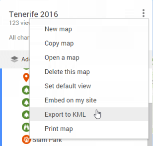
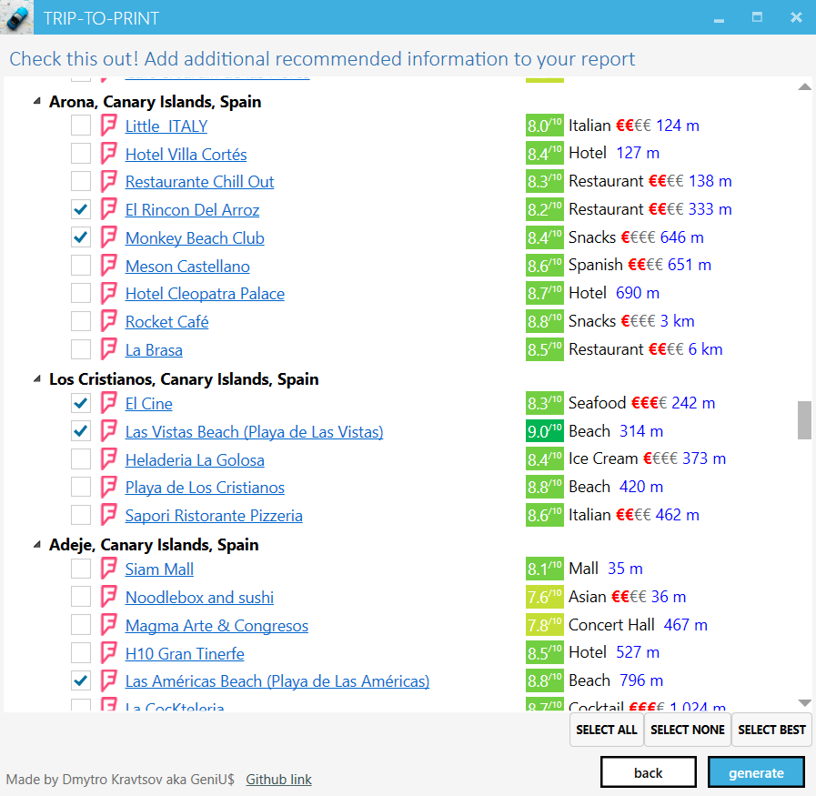
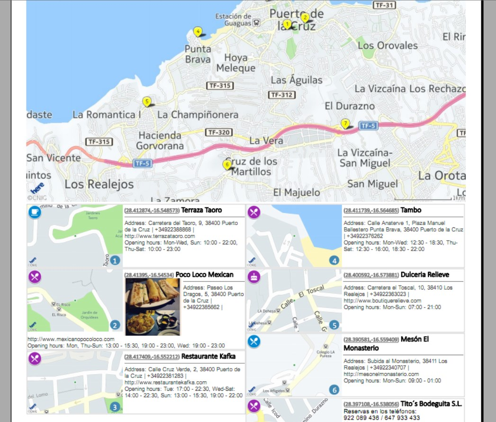

# Trip to Print
A WinForms application which converts KMZ/KML files to a handy HTML report

# Usage
1. Download and compile with [Visual Studio 2015](https://www.visualstudio.com)
2. Open your [Google MyMap](https://www.google.com/maps/d/) 

3. Export your map to KMZ file 

4. Run the Trip2Print application, select KMZ file and start a report generation 

5. Open the generated file in Google Chrome and press Ctrl+P 

6. Print it out
7. Optionally you may select "Save as PDF" as a Destination for printing and copy a generated PDF file on your mobile device.

# Features
* Overview maps for smartly generated groups of POIs
* Thumbnail maps for placemarks
* Pictures from Google MyMaps are supported
* Showing coordinates for every placemark
* Clickable coordinates for easier navigation from mobile devices

# To Do
* Make the output layout of placemarks more flexible
* Optional rendering of overview maps
* Optional rendering of placemark's thumbnails
* Use a Google MyMap url as a source for report generation (in addition to a file source)
* Export to PDF directly from application
* Option to select the map source:
    1) HERE (implemented)
    2) Google Static Maps (https://developers.google.com/maps/documentation/static-maps/intro)

# Known issues
* Placemarks layout is still stupid
* Old Google MyMaps icons are not supported
* Google MyMaps Directions are not supported
* Sometimes not a beautiful output of placemarks
